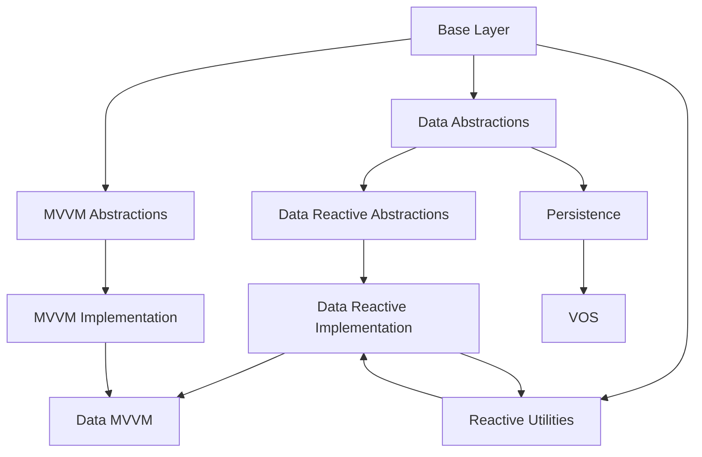

# LionFire.Core Architecture

> High-level architectural documentation for the LionFire.Core repository

## Overview

LionFire.Core is a collection of mini-frameworks and toolkits for .NET development, organized using a layered architecture philosophy. This document provides an overview of the system architecture and guides you to more detailed architectural documentation.

## Architectural Philosophy

### Three-Layer Design

LionFire follows a strict layering approach from minimal to opinionated:

```
┌─────────────────────────────────────────────┐
│           Layer 3: Frameworks               │
│        (Opinionated Integration)            │
│  LionFire.Framework, AspNetCore.Framework   │
└─────────────────────────────────────────────┘
                    ↑
┌─────────────────────────────────────────────┐
│           Layer 2: Toolkits                 │
│      (Unopinionated, A la carte)            │
│   Data, MVVM, Hosting, Serialization, VOS   │
└─────────────────────────────────────────────┘
                    ↑
┌─────────────────────────────────────────────┐
│             Layer 1: Base                   │
│       (Minimal Dependencies, BCL+)          │
│    Base, Flex, Structures, Extensions       │
└─────────────────────────────────────────────┘
```

### Design Principles

1. **Decoupled but Sharing Common Interfaces**
   - Components are loosely coupled
   - Share abstractions for interoperability
   - Can be used independently or together

2. **Raise the Lowest Common Denominator**
   - Extend BCL functionality
   - Provide patterns applicable across domains
   - Enable cross-cutting concerns (multi-typing, etc.)

3. **Toolkit to Framework Progression**
   - Start with unopinionated toolkits
   - Compose into opinionated frameworks
   - Choose your level of abstraction

4. **Exploratory Development**
   - Many toolkits are experimental
   - Successful patterns promoted to first-class
   - Flexibility to evolve and adapt

## Domain Architecture

### Data Architecture

**✅ Partially Completed October 2025**

Complete documentation for async data patterns; VOS reference docs available.

**Subdirectories:**
- [**async/**](data/async/) - **✅ Completed** - Async data access patterns
  - [Overview](data/async/README.md) - Async data architecture
  - [Async Patterns](data/async/async-patterns.md) - Getter/Setter/Value patterns
  - [Reactive Data](data/async/reactive-data.md) - ReactiveUI integration
  - [Persistence Integration](data/async/persistence-integration.md) - File-based persistence
- [**vos/**](data/vos/) - Virtual Object System reference
  - [VOS Overview](../data/vos/vos-overview.md)
  - [VOS Architecture](../data/vos/vos-architecture.md)
  - [Analysis](data/vos/analysis/) - Architectural critique and recommendations

**Key Concepts:**
- Async data patterns - `IGetter<T>`, `ISetter<T>`, `IValue<T>`
- Reactive persistence - `IObservableReader<TKey, TValue>`, `IObservableWriter<TKey, TValue>`
- Virtual Object System (VOS) - Mount multiple data sources
- Lazy loading and caching strategies
- Integration with MVVM layer

[→ Read More: Data Architecture](data/)

### MVVM Architecture

**✅ Completed October 2025**

Complete documentation for MVVM patterns, ViewModels, and UI integration.

**Available Documentation:**
- [MVVM Architecture Overview](mvvm/README.md) - Philosophy and integration
- [MVVM Layers](mvvm/mvvm-layers.md) - Detailed layer breakdown
- [Reactive MVVM](mvvm/reactive-mvvm.md) - ReactiveUI patterns
- [Data Binding](mvvm/data-binding.md) - Integration with async data
- [UI Frameworks](mvvm/ui-frameworks.md) - Blazor/WPF support

**Key Concepts:**
- `IViewModel<T>` pattern wrapping models
- ReactiveUI + CommunityToolkit.Mvvm integration
- DynamicData for observable collections
- ViewModels for async data access (GetterVM, ValueVM, ObservableReaderVM)
- Workspace-scoped ViewModel services

**Current Status:**
- ✅ Complete architecture documentation
- ✅ 6 libraries documented (Mvvm.Abstractions, Mvvm, Data.Async.Mvvm, Blazor.Components.MudBlazor, etc.)

[→ Read More: MVVM Architecture](mvvm/)

### Reactive Architecture

*Coming Soon*

Documentation for reactive programming patterns and utilities.

**Planned Content:**
- ReactiveUI integration
- DynamicData usage patterns
- Observable persistence
- On-demand resource management
- Runner lifecycle patterns

**Current Status:**
- ✅ 1 library documented (LionFire.Reactive)
- 🚧 Architecture documentation planned (see [TASKS.md](../TASKS.md))

[→ Read More: Reactive Architecture](reactive/) *(Coming Soon)*

### Workspaces Architecture

**✅ Completed October 2025**

Complete documentation for workspace patterns and workspace-scoped services.

**Available Documentation:**
- [Workspaces Architecture Overview](workspaces/README.md) - User-centric data containers
- [Service Scoping](workspaces/service-scoping.md) - Workspace-scoped DI (CRITICAL)
- [Document Types](workspaces/document-types.md) - Defining workspace document types

**Key Concepts:**
- Workspace-scoped dependency injection for isolation
- Multi-workspace support
- Document type registration and persistence
- `IObservableReader/Writer` per workspace
- Integration with Blazor (cascading WorkspaceServices)
- Directory-based persistence (HJSON)

**Current Status:**
- ✅ Complete architecture documentation
- ✅ 2 libraries documented (Workspaces.Abstractions, Workspaces)
- ✅ Blazor integration documented (Blazor.Components.MudBlazor)

[→ Read More: Workspaces Architecture](workspaces/)

## Cross-Cutting Patterns

### Async Data Access Pattern

One of the most important cross-cutting patterns in LionFire:

```
┌──────────────────────────────────────────────────────────┐
│                  Application/UI Layer                     │
│              (WPF, Blazor, Console, etc.)                 │
└──────────────────────┬───────────────────────────────────┘
                       │
                       │ Binds to ViewModels
                       ↓
┌──────────────────────────────────────────────────────────┐
│                    MVVM Layer                             │
│   GetterVM<T>, ValueVM<T>, ObservableReaderVM<T>         │
│   - ReactiveCommands                                      │
│   - Observable state (IsLoading, HasValue)                │
│   - Polling, auto-refresh                                 │
└──────────────────────┬───────────────────────────────────┘
                       │
                       │ Wraps reactive implementations
                       ↓
┌──────────────────────────────────────────────────────────┐
│              Reactive Implementation Layer                 │
│   GetterRxO<T>, ValueRxO<T>, AsyncDynamicDataCollection   │
│   - ReactiveObject base                                   │
│   - Property change notifications                         │
│   - DynamicData collections                               │
└──────────────────────┬───────────────────────────────────┘
                       │
                       │ Implements reactive interfaces
                       ↓
┌──────────────────────────────────────────────────────────┐
│           Reactive Abstractions Layer                     │
│   IGetterRxO<T>, IValueRxO<T>, IReactiveObjectEx         │
│   - Marker interfaces for ReactiveObject                  │
│   - Ensures property change notifications                 │
└──────────────────────┬───────────────────────────────────┘
                       │
                       │ Extends core abstractions
                       ↓
┌──────────────────────────────────────────────────────────┐
│              Async Data Abstractions Layer                │
│   IGetter<T>, ISetter<T>, IValue<T>                       │
│   - Core async operations (Get, Set)                      │
│   - Observable operations                                 │
│   - Lazy loading, caching                                 │
└──────────────────────┬───────────────────────────────────┘
                       │
                       │ Operates on data sources
                       ↓
┌──────────────────────────────────────────────────────────┐
│                 Data Source Layer                         │
│   Files, Databases, APIs, VOS, Memory                     │
└──────────────────────────────────────────────────────────┘
```

**Why This Matters:**
- **Separation of Concerns**: Each layer has a clear responsibility
- **Flexibility**: Can use any layer independently
- **UI-Friendly**: ViewModels abstract complexity from UI
- **Reactive**: All state changes observable
- **Testable**: Each layer can be mocked/tested independently

### Multi-Typing Pattern

LionFire uses multi-typing extensively:

```csharp
// Objects can dynamically present multiple type interfaces
public class MyObject : IFlex  // Enables multi-typing
{
    object? IFlex.FlexData { get; set; }
}

// Can add interfaces at runtime via FlexData
var obj = new MyObject();
obj.As<ISerializable>()  // Access as different interface
```

Used throughout:
- VOS Vobs (virtual objects)
- Handles with multiple capabilities
- ViewModel adapters
- Service composition

### Dependency Injection

Microsoft.Extensions.DependencyInjection used throughout:

- **Base Layer**: No DI (pure utility classes)
- **Toolkit Layer**: Provides extension methods for registration
- **Framework Layer**: Opinionated DI setup

```csharp
// Typical toolkit registration
services.AddLionFirePersistence();
services.AddMvvm(typeof(MyViewModels).Assembly);
services.AddVos();

// Framework gives you everything
services.AddLionFire();  // All the things!
```

## Key Architectural Decisions

### Decision: Async-First Data Access

**Context**: Modern applications need async I/O for responsiveness

**Decision**: All data access operations are async by default

**Consequences:**
- ✅ Better UI responsiveness
- ✅ Supports high-concurrency scenarios
- ✅ Natural fit for web APIs
- ⚠️ Slightly more complex API surface
- ⚠️ Need to handle async composition

**Implementation**: `IGetter<T>`, `ISetter<T>` with `ITask<T>`/`Task<T>`

### Decision: ReactiveUI for MVVM

**Context**: Need reactive patterns for modern UIs

**Decision**: Build MVVM on top of ReactiveUI

**Consequences:**
- ✅ Powerful reactive programming model
- ✅ Cross-platform (WPF, Avalonia, Blazor, etc.)
- ✅ Well-maintained community project
- ⚠️ Learning curve for reactive patterns
- ⚠️ Dependency on external library

**Implementation**: `IGetterRxO`, `ValueRxO`, ViewModels with ReactiveCommands

### Decision: DynamicData for Collections

**Context**: Need reactive collections with change notifications

**Decision**: Use DynamicData for all observable collections

**Consequences:**
- ✅ Efficient incremental updates
- ✅ Rich transformation operators
- ✅ Integrates with ReactiveUI
- ⚠️ Adds complexity vs simple ObservableCollection
- ⚠️ Another external dependency

**Implementation**: `IObservableCache<T, TKey>`, `SourceCache`, `IChangeSet`

### Decision: Layered Abstractions

**Context**: Want flexibility and testability

**Decision**: Multiple abstraction layers (Base → Reactive Abstractions → Reactive → MVVM)

**Consequences:**
- ✅ Can use any layer independently
- ✅ Easy to test (mock at any layer)
- ✅ Flexibility in implementation choices
- ⚠️ More projects/complexity
- ⚠️ Need to understand layer relationships

**Implementation**: See Async Data Access Pattern diagram above

## Dependencies Between Domains



## Technology Stack

### Target Framework
- **.NET 9.0** (with legacy .NET Framework 4.8 and netstandard2.0 support)
- **SDK**: .NET 9.0.107 (pinned in `global.json`)
- **Language**: Latest C# version
- **Features**: Nullable reference types, file-scoped namespaces

### Key Dependencies

**Reactive Programming:**
- ReactiveUI 20.x - Reactive MVVM framework
- DynamicData 9.x - Observable collections
- System.Reactive 6.x - Reactive Extensions

**MVVM:**
- CommunityToolkit.Mvvm 8.x - Source generators

**Dependency Injection:**
- Microsoft.Extensions.DependencyInjection 9.x
- Microsoft.Extensions.Hosting 9.x

**Serialization:**
- Newtonsoft.Json 13.x
- System.Text.Json (built-in)
- Hjson 4.x
- YamlDotNet 16.x

**UI Frameworks:**
- MudBlazor 8.x (Blazor components)
- WPF (legacy support)

**Persistence:**
- LiteDB, Redis, PostgreSQL (via Marten), CouchDB, and others

### Build System

**Central Package Management (CPM):**
- Package versions in `Directory.Packages.props`
- Projects reference packages without version attributes
- Ensures version consistency across repository

**MSBuild:**
- Common settings in `Directory.Build.props`
- Version: `7.0.0-alpha`
- Portable PDB with embedded sources
- Reference assemblies for faster builds

## Repository Organization

### Solution Files
- **Core.sln** - Primary solution for core libraries
- **All.sln** - Comprehensive solution (all projects)
- **Execution.sln** - Execution-related projects
- **Machine.sln** - Machine-specific projects

### Directory Structure

```
/mnt/c/src/Core/
├── src/                    # All source code (~200+ projects)
│   ├── LionFire.Base/      # Base layer
│   ├── LionFire.Mvvm*/     # MVVM layer
│   ├── LionFire.Data*/     # Data layer
│   ├── LionFire.Vos*/      # VOS
│   ├── LionFire.Persistence*/ # Persistence backends
│   ├── LionFire.Blazor*/   # Blazor components
│   ├── LionFire.Workspaces*/ # Workspaces
│   └── ...
├── test/                   # Test projects
├── docs/                   # Documentation
│   ├── architecture/       # This directory
│   ├── data/              # Data domain docs
│   ├── mvvm/              # MVVM domain docs
│   ├── workspaces/        # Workspaces docs
│   ├── ui/                # UI patterns docs
│   └── guides/            # How-to guides
├── attic/                  # Deprecated code
├── build/                  # Build scripts
├── Directory.Build.props   # Common MSBuild settings
├── Directory.Packages.props # Central package versions
└── global.json            # SDK version
```

### Naming Conventions
- **Projects**: `LionFire.<Component>[.<SubComponent>]`
- **Abstractions**: `LionFire.<Component>.Abstractions`
- **Tests**: `LionFire.<Component>.Tests`

## Architecture Documentation Status

See [../TASKS.md](../TASKS.md) for the complete documentation project plan.

### Completed (October 2025)
- ✅ **MVVM Architecture** - Complete documentation (5 docs)
- ✅ **Async Data Architecture** - Complete documentation (4 docs)
- ✅ **Workspaces Architecture** - Complete documentation (3 docs)
- ✅ **VOS Reference** - Complete reference documentation
- ✅ **VOS Architectural Analysis** - Critique and recommendations
- ✅ **11 CLAUDE.md files** - MVVM, Data, Reactive, Workspaces, Blazor libraries
- ✅ **UI/Blazor Patterns** - Blazor MVVM component patterns

### In Progress
- 🚧 **Core Architecture Documentation** (this task)
  - ✅ Architecture README (enhanced)
  - 🚧 Layers documentation
  - 🚧 Dependency graph documentation

### Planned
- 📋 Reactive architecture documentation
- 📋 Complete CLAUDE.md coverage for all libraries (Base, VOS, Persistence, etc.)
- 📋 How-to guides for common patterns
- 📋 Getting started tutorials
- 📋 Integration guides

## Related Documentation

- [Main Documentation README](../README.md)
- [Documentation Project Plan](../TASKS.md)
- [Repository CLAUDE.md](../../CLAUDE.md)

## Questions to Explore

When diving into the architecture, consider:

1. **Layer Boundaries**: Where should I place my new component?
2. **Dependencies**: What dependencies are appropriate for my layer?
3. **Patterns**: Which existing patterns can I follow?
4. **Integration**: How do I integrate with other domains?
5. **Testing**: How do I test components at this layer?

---

*This architecture documentation is under active development. See [TASKS.md](../TASKS.md) for progress.*
