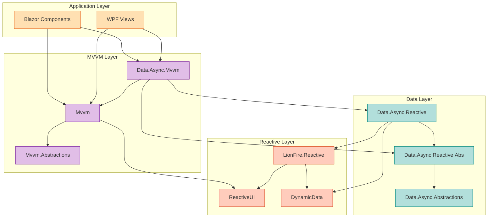
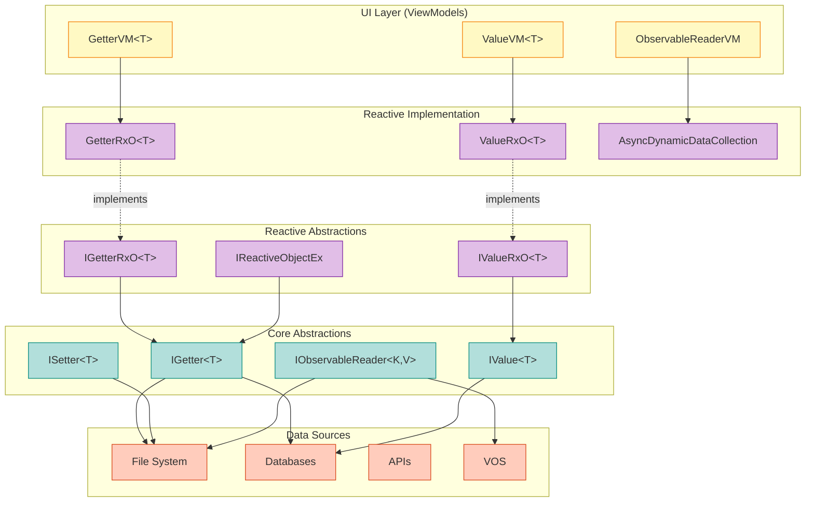
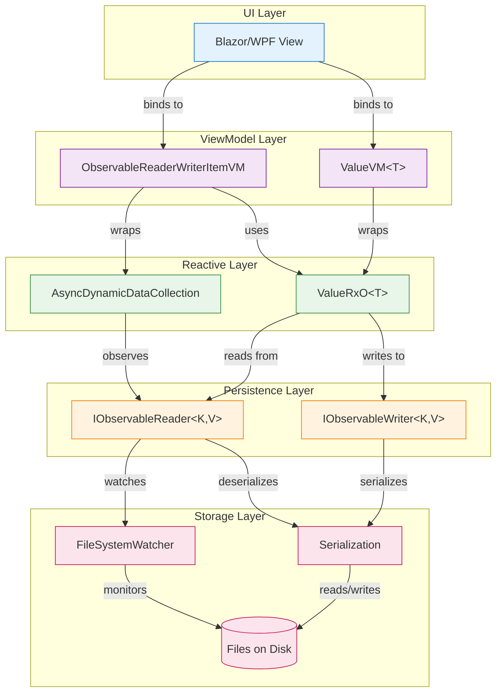
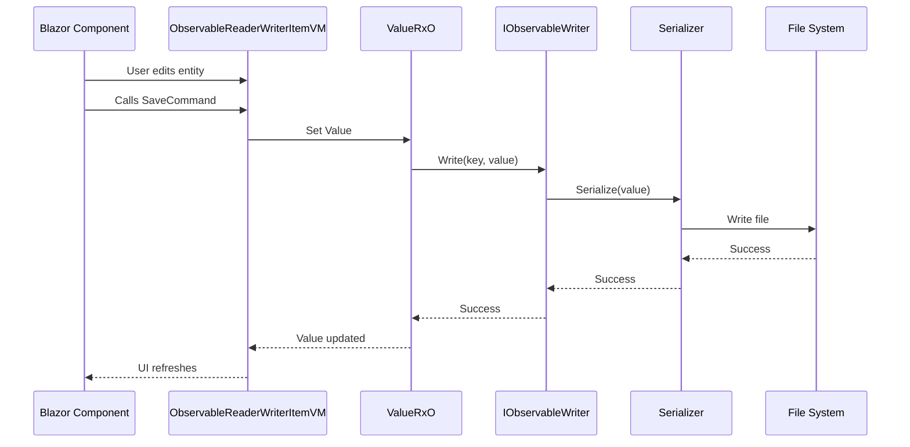
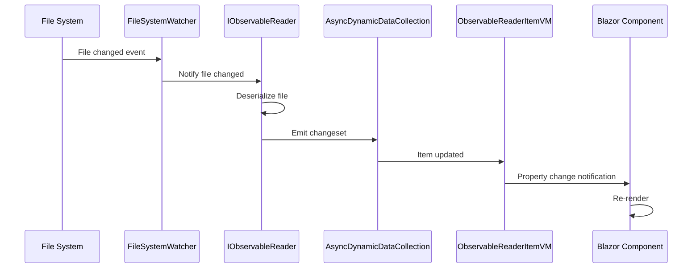
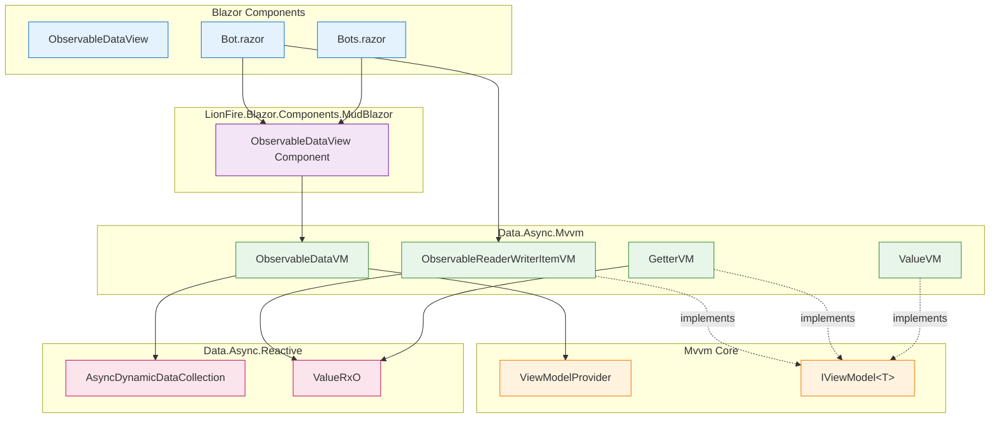
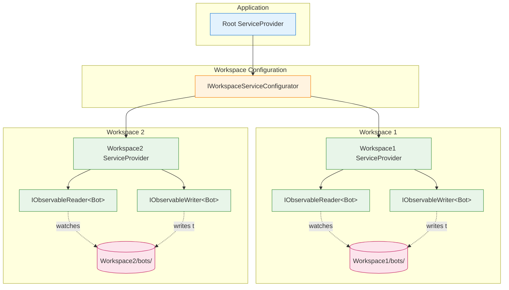
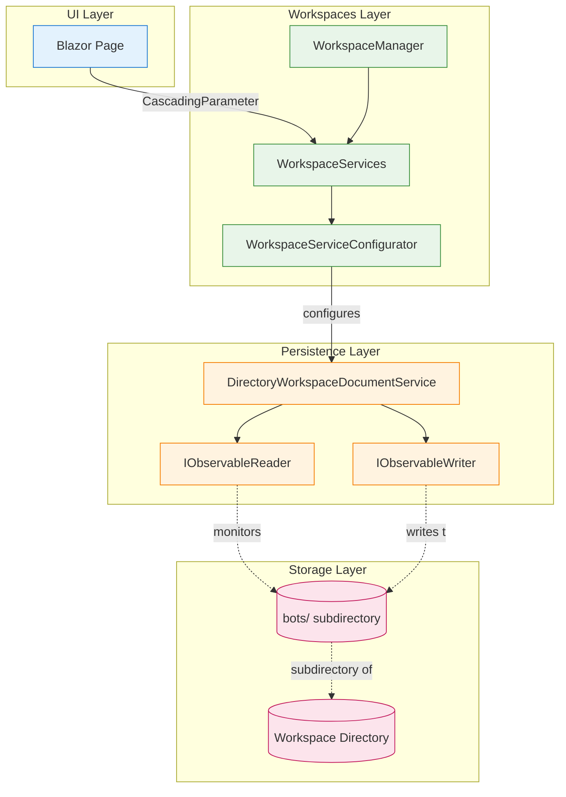
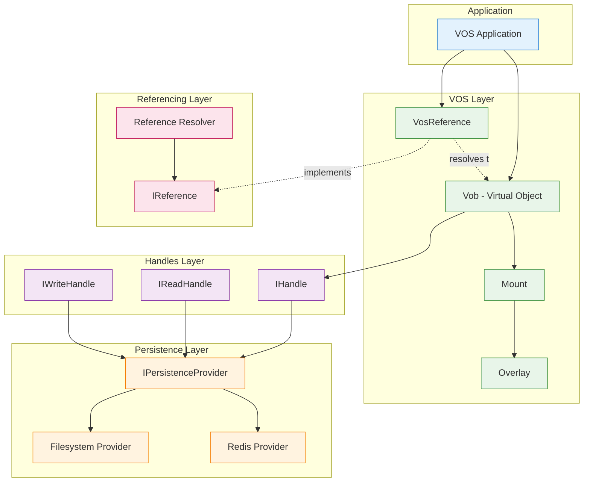

# LionFire.Core Dependency Graph

**Purpose**: Visual dependency diagrams, project dependency matrix, and guidelines for managing dependencies across the repository.

---

## Table of Contents

1. [Layer Dependencies](#layer-dependencies)
2. [Domain Dependencies](#domain-dependencies)
3. [Complete Async Data Stack](#complete-async-data-stack)
4. [MVVM Stack](#mvvm-stack)
5. [Workspaces Integration](#workspaces-integration)
6. [VOS Dependencies](#vos-dependencies)
7. [Dependency Matrix](#dependency-matrix)
8. [Managing Dependencies](#managing-dependencies)

---

## Layer Dependencies

### High-Level Layer Diagram

```mermaid
graph TB
    subgraph Framework["Layer 3: Framework"]
        LF[LionFire.Framework]
        ACF[AspNetCore.Framework]
        VAF[Vos.App.Framework]
        FE[Core.Extras]
    end

    subgraph Toolkits["Layer 2: Toolkits"]
        subgraph MVVM["MVVM Domain"]
            MA[Mvvm.Abstractions]
            M[Mvvm]
            DAM[Data.Async.Mvvm]
        end

        subgraph Data["Data Domain"]
            DA[Data.Async.Abstractions]
            DRA[Data.Async.Reactive.Abs]
            DR[Data.Async.Reactive]
            R[Reactive]
        end

        subgraph Persistence["Persistence Domain"]
            PA[Persistence.Abstractions]
            P[Persistence]
            PFS[Persistence.Filesystem]
            PR[Persistence.Redis]
        end

        subgraph VOS["VOS Domain"]
            VA[Vos.Abstractions]
            V[Vos]
            VF[Vos.Framework]
        end

        subgraph Workspaces["Workspaces Domain"]
            WA[Workspaces.Abstractions]
            W[Workspaces]
        end

        subgraph Serialization["Serialization"]
            S[Serialization]
            SJ[Serialization.Json]
        end

        subgraph Hosting["Hosting"]
            HA[Hosting.Abstractions]
            H[Hosting]
        end
    end

    subgraph Base["Layer 1: Base"]
        B[LionFire.Base]
        F[LionFire.Flex]
        ST[LionFire.Structures]
    end

    %% Framework to Toolkit dependencies
    LF --> M
    LF --> P
    LF --> V
    ACF --> M
    VAF --> V
    FE --> MA

    %% MVVM dependencies
    M --> MA
    MA --> B
    DAM --> M
    DAM --> DR
    DAM --> DRA

    %% Data dependencies
    DR --> DRA
    DRA --> DA
    DA --> B
    R --> B

    %% Persistence dependencies
    P --> PA
    PA --> B
    PFS --> P
    PR --> P

    %% VOS dependencies
    V --> VA
    VA --> PA
    VF --> V
    V --> P

    %% Workspaces dependencies
    W --> WA
    WA --> B
    W --> DR
    W --> P

    %% Serialization dependencies
    SJ --> S
    S --> B

    %% Hosting dependencies
    H --> HA
    HA --> B

    %% Base dependencies
    F --> B
    ST --> B
    ST --> F

    classDef framework fill:#e1f5ff,stroke:#0288d1
    classDef toolkit fill:#fff9c4,stroke:#f57c00
    classDef base fill:#c8e6c9,stroke:#388e3c

    class LF,ACF,VAF,FE framework
    class MA,M,DAM,DA,DRA,DR,R,PA,P,PFS,PR,VA,V,VF,WA,W,S,SJ,HA,H toolkit
    class B,F,ST base
```



### Layer Dependency Rules

**✅ Allowed**:
- Framework → Toolkits
- Framework → Base
- Toolkits → Toolkits (carefully)
- Toolkits → Base
- Base → Base

**❌ Forbidden**:
- Base → Toolkits
- Base → Framework
- Toolkits → Framework
- Circular dependencies

---

## Domain Dependencies

### MVVM Domain Detailed



### Data Domain Detailed



---

## Complete Async Data Stack

### Full Stack from Data Source to UI



### Data Flow Example

**User saves entity in UI:**



**File changes externally:**



---

## MVVM Stack

### MVVM Component Dependencies



---

## Workspaces Integration

### Workspaces Service Scoping



**Key Point**: Each workspace has its own scoped `ServiceProvider` with isolated `IObservableReader/Writer` instances pointing to different directories.

### Workspace Component Stack



---

## VOS Dependencies

### VOS Core Architecture



### VOS Mount Stack

```mermaid
graph TB
    subgraph VirtualTree["Virtual Object Tree"]
        Root[/]
        App[/app]
        Config[/app/config]
        Data[/app/data]
    end

    subgraph Mounts["Mounts"]
        FSMount[Filesystem Mount]
        RedisMount[Redis Mount]
        OverlayMount[Overlay Mount]
    end

    subgraph Storage["Physical Storage"]
        FSDir[(Filesystem Directory)]
        RedisDB[(Redis Database)]
    end

    %% Virtual tree structure
    Root --> App
    App --> Config
    App --> Data

    %% Mounts to virtual paths
    FSMount -.mounted at.-> App
    RedisMount -.mounted at.-> Data
    OverlayMount -.overlays.-> App

    %% Mounts to storage
    FSMount --> FSDir
    RedisMount --> RedisDB

    classDef vtree fill:#e3f2fd,stroke:#1976d2
    classDef mounts fill:#e8f5e9,stroke:#388e3c
    classDef storage fill:#fce4ec,stroke:#c2185b

    class Root,App,Config,Data vtree
    class FSMount,RedisMount,OverlayMount mounts
    class FSDir,RedisDB storage
```

---

## Dependency Matrix

### Core Library Dependencies

| Library | Base | Flex | Structures | Data.Async.Abs | MVVM.Abs | Persistence.Abs |
|---------|------|------|------------|----------------|----------|-----------------|
| **Base** | - | - | - | - | - | - |
| **Flex** | ✅ | - | - | - | - | - |
| **Structures** | ✅ | ✅ | - | - | - | - |
| **Data.Async.Abs** | ✅ | - | - | - | - | - |
| **Data.Async.Reactive.Abs** | ✅ | - | - | ✅ | - | - |
| **Data.Async.Reactive** | ✅ | - | - | ✅ | - | - |
| **MVVM.Abstractions** | ✅ | - | - | - | - | - |
| **MVVM** | ✅ | - | - | - | ✅ | - |
| **Data.Async.Mvvm** | ✅ | - | - | ✅ | ✅ | - |
| **Persistence.Abs** | ✅ | - | - | - | - | - |
| **Persistence** | ✅ | - | - | - | - | ✅ |
| **Vos.Abstractions** | ✅ | - | - | - | - | ✅ |
| **Vos** | ✅ | ✅ | - | - | - | ✅ |
| **Workspaces.Abs** | ✅ | - | - | - | - | - |
| **Workspaces** | ✅ | - | - | ✅ | - | ✅ |

### External Package Dependencies

| Library | ReactiveUI | DynamicData | CommunityToolkit.Mvvm | Newtonsoft.Json |
|---------|-----------|-------------|----------------------|-----------------|
| **Data.Async.Reactive** | ✅ | ✅ | - | - |
| **MVVM** | ✅ | - | - | - |
| **Data.Async.Mvvm** | ✅ | ✅ | ✅ | - |
| **Reactive** | ✅ | ✅ | - | - |
| **Serialization.Json** | - | - | - | ✅ |

---

## Managing Dependencies

### Circular Dependency Detection

**Check for circular dependencies:**

```bash
# Using dotnet list package with --include-transitive
dotnet-win list package --include-transitive | grep "LionFire"

# Check for circular references in a specific project
dotnet-win list src/LionFire.Mvvm/LionFire.Mvvm.csproj reference
```

**Common circular dependency scenarios to avoid:**

❌ **Bad: Toolkit depends on Framework**
```
LionFire.Mvvm → LionFire.Framework
LionFire.Framework → LionFire.Mvvm  // Circular!
```

❌ **Bad: Base depends on Toolkit**
```
LionFire.Base → LionFire.Mvvm  // Base cannot depend on Toolkit!
```

### Adding New Dependencies

**Checklist before adding a dependency:**

1. **Check layer rules**:
   - [ ] Am I in the right layer?
   - [ ] Does the dependency respect layer hierarchy?

2. **Prefer abstractions**:
   - [ ] Can I depend on the abstraction instead of implementation?
   - [ ] Will this create tight coupling?

3. **External packages**:
   - [ ] Is this package absolutely necessary?
   - [ ] Is it maintained and compatible with .NET 9?
   - [ ] Add to `Directory.Packages.props` (Central Package Management)

4. **Document the dependency**:
   - [ ] Update this dependency graph if it's a significant architectural dependency
   - [ ] Add comments in `.csproj` if the dependency is non-obvious

### Dependency Guidelines

**DO**:
- ✅ Depend on abstractions over implementations
- ✅ Keep Base layer free of external dependencies
- ✅ Use Central Package Management for version consistency
- ✅ Document architectural dependencies
- ✅ Minimize inter-toolkit coupling

**DON'T**:
- ❌ Create circular dependencies
- ❌ Make Base layer depend on Toolkits
- ❌ Make Toolkits depend on Frameworks
- ❌ Add external packages without consideration
- ❌ Tightly couple toolkits without abstractions

### Refactoring Dependencies

**When you find a problematic dependency:**

1. **Identify the issue**:
   - Is it circular?
   - Is it violating layer rules?
   - Is it creating tight coupling?

2. **Choose a refactoring strategy**:
   - Extract abstraction to separate assembly
   - Move functionality to appropriate layer
   - Use dependency injection to invert dependency
   - Create adapter/bridge pattern

3. **Example refactoring**:

**Before (Bad)**:
```
LionFire.Mvvm (Toolkit)
  → LionFire.Data.Async.Reactive (Toolkit Implementation)  // Tight coupling
```

**After (Good)**:
```
LionFire.Mvvm (Toolkit)
  → LionFire.Data.Async.Reactive.Abstractions (Toolkit Abstraction)  // Loose coupling
```

### Dependency Visualization Tools

**Recommended tools for visualizing dependencies:**

1. **MSBuild Binary Log Viewer**:
   ```bash
   dotnet-win build -bl
   # Open .binlog file in viewer
   ```

2. **Visual Studio Dependency Diagrams** (Enterprise edition)

3. **dotnet-depends** (NuGet package):
   ```bash
   dotnet tool install -g dotnet-depends
   dotnet depends src/LionFire.Mvvm/LionFire.Mvvm.csproj
   ```

4. **Custom script** (for this repository):
   ```bash
   # List all LionFire project references
   find src -name "*.csproj" -exec grep -H "LionFire" {} \;
   ```

---

## Guidelines for New Projects

### Pre-Flight Dependency Checklist

Before creating a new project:

1. **Determine layer**:
   - [ ] Base (no external deps)
   - [ ] Toolkit (domain-specific)
   - [ ] Framework (integrated)

2. **Plan dependencies**:
   - [ ] List required LionFire projects
   - [ ] List required external packages
   - [ ] Verify no circular dependencies
   - [ ] Verify layer rules respected

3. **Create abstractions if needed**:
   - [ ] Will other projects need to depend on this?
   - [ ] Should I create a separate `.Abstractions` project?

4. **Document architecture**:
   - [ ] Update this dependency graph if significant
   - [ ] Add to appropriate domain documentation

### Example: Adding a New Toolkit

**Scenario**: Create a new "LionFire.Caching" toolkit

**Step 1: Plan dependencies**
```
LionFire.Caching.Abstractions
  → LionFire.Base (✅ allowed)

LionFire.Caching
  → LionFire.Caching.Abstractions (✅ allowed)
  → LionFire.Base (✅ allowed)
  → Microsoft.Extensions.Caching.Memory (✅ external package OK)
```

**Step 2: Add to Directory.Packages.props**
```xml
<PackageVersion Include="Microsoft.Extensions.Caching.Memory" Version="9.0.0" />
```

**Step 3: Create projects**
```bash
dotnet new classlib -n LionFire.Caching.Abstractions -o src/LionFire.Caching.Abstractions
dotnet new classlib -n LionFire.Caching -o src/LionFire.Caching
```

**Step 4: Add dependencies**
```bash
# Abstractions
dotnet add src/LionFire.Caching.Abstractions reference src/LionFire.Base

# Implementation
dotnet add src/LionFire.Caching reference src/LionFire.Caching.Abstractions
dotnet add src/LionFire.Caching reference src/LionFire.Base
dotnet add src/LionFire.Caching package Microsoft.Extensions.Caching.Memory
```

**Step 5: Update documentation**
- Add to this dependency graph (Toolkit section)
- Create `src/LionFire.Caching/CLAUDE.md`
- Update `docs/README.md` if appropriate

---

## Summary

### Dependency Principles

1. **Respect layer hierarchy**: Framework → Toolkit → Base
2. **Prefer abstractions**: Depend on interfaces, not implementations
3. **Avoid circular dependencies**: Use dependency inversion
4. **Minimize coupling**: Toolkits should be loosely coupled
5. **Document dependencies**: Keep this graph updated

### Quick Reference

| From Layer | Can Depend On |
|------------|---------------|
| **Framework** | Toolkits, Base, External Packages |
| **Toolkit** | Other Toolkits (carefully), Base, External Packages |
| **Base** | Other Base libraries, BCL only |

### Tools for Managing Dependencies

- **Central Package Management**: `Directory.Packages.props`
- **MSBuild Binary Log**: `dotnet-win build -bl`
- **Reference Listing**: `dotnet-win list reference`
- **Package Listing**: `dotnet-win list package`

---

**Related Documentation**:
- [Architecture Overview](README.md)
- [Layer Architecture](layers.md)
- [Main Documentation](../README.md)
- [Repository CLAUDE.md](../../CLAUDE.md)
