# Workspace Integration Architecture

**Purpose**: Visual reference showing complete integration flow from application startup through UI consumption. This document provides diagrams and sequence flows to complement the textual documentation in other workspace architecture docs.

---

## Table of Contents

1. [Complete Stack Overview](#complete-stack-overview)
2. [Service Registration Flow](#service-registration-flow)
3. [Workspace Lifecycle](#workspace-lifecycle)
4. [Component Interaction Patterns](#component-interaction-patterns)
5. [Data Flow Diagrams](#data-flow-diagrams)
6. [Service Resolution Paths](#service-resolution-paths)

---

## Complete Stack Overview

### Full Architecture Stack

```
┌────────────────────────────────────────────────────────────────────┐
│                         User Interface Layer                        │
│  ┌──────────────────────────────────────────────────────────────┐  │
│  │ Blazor Components                                             │  │
│  │ - WorkspaceSelector.razor                                     │  │
│  │ - WorkspaceGrid.razor                                         │  │
│  │ - ObservableDataView<TKey, TValue, TVM>                      │  │
│  │ - Custom pages consuming workspace services                   │  │
│  └────────────────────────┬─────────────────────────────────────┘  │
│                           │ Consumes via                            │
│                           │ CascadingParameter                      │
└───────────────────────────┼─────────────────────────────────────────┘
                            ↓
┌────────────────────────────────────────────────────────────────────┐
│                       ViewModel Layer                               │
│  ┌──────────────────────────────────────────────────────────────┐  │
│  │ WorkspaceLayoutVM                                             │  │
│  │ - Manages workspace lifecycle                                 │  │
│  │ - Creates/disposes workspace service providers                │  │
│  │ - Provides WorkspaceServices to descendants                   │  │
│  └────────────────────────┬─────────────────────────────────────┘  │
│  ┌──────────────────────────────────────────────────────────────┐  │
│  │ Document ViewModels                                           │  │
│  │ - ObservableReaderWriterItemVM<TKey, TValue, TVM>           │  │
│  │ - BotVM, PortfolioVM, etc.                                   │  │
│  └────────────────────────┬─────────────────────────────────────┘  │
│                           │ Injects                                 │
└───────────────────────────┼─────────────────────────────────────────┘
                            ↓
┌────────────────────────────────────────────────────────────────────┐
│               Workspace-Scoped Service Provider                     │
│  ┌──────────────────────────────────────────────────────────────┐  │
│  │ Per-Workspace IServiceProvider                                │  │
│  │ - IObservableReader<string, BotEntity>                        │  │
│  │ - IObservableWriter<string, BotEntity>                        │  │
│  │ - IObservableReader<string, Portfolio>                        │  │
│  │ - IObservableWriter<string, Portfolio>                        │  │
│  │ - (One set per workspace)                                     │  │
│  └────────────────────────┬─────────────────────────────────────┘  │
│                           │ Configured by                           │
└───────────────────────────┼─────────────────────────────────────────┘
                            ↓
┌────────────────────────────────────────────────────────────────────┐
│                  Workspace Infrastructure Layer                     │
│  ┌──────────────────────────────────────────────────────────────┐  │
│  │ UserWorkspacesService                                         │  │
│  │ - Manages workspace base directory                            │  │
│  │ - UserWorkspaces: IReference                                  │  │
│  └──────────────────────────────────────────────────────────────┘  │
│  ┌──────────────────────────────────────────────────────────────┐  │
│  │ IWorkspaceServiceConfigurator[]                               │  │
│  │ - WorkspaceTypesConfigurator (core)                           │  │
│  │ - Custom application configurators                            │  │
│  └──────────────────────────────────────────────────────────────┘  │
│  ┌──────────────────────────────────────────────────────────────┐  │
│  │ WorkspaceConfiguration                                        │  │
│  │ - MemberTypes: List<Type>                                     │  │
│  │ - Registry of document types                                  │  │
│  └────────────────────────┬─────────────────────────────────────┘  │
│                           │ Uses                                    │
└───────────────────────────┼─────────────────────────────────────────┘
                            ↓
┌────────────────────────────────────────────────────────────────────┐
│                   Reactive Persistence Layer                        │
│  ┌──────────────────────────────────────────────────────────────┐  │
│  │ HjsonFsDirectoryReaderRx<TKey, TValue>                        │  │
│  │ HjsonFsDirectoryWriterRx<TKey, TValue>                        │  │
│  │ - File system watching                                        │  │
│  │ - HJSON serialization                                         │  │
│  │ - Observable change notifications                             │  │
│  └────────────────────────┬─────────────────────────────────────┘  │
│                           │ Reads/Writes                            │
└───────────────────────────┼─────────────────────────────────────────┘
                            ↓
┌────────────────────────────────────────────────────────────────────┐
│                        File System Layer                            │
│  C:\Users\Alice\Trading\Workspaces\                                │
│  ├── workspace1.hjson              ← Workspace metadata             │
│  └── workspace1\                   ← Workspace directory            │
│      ├── Bots\                     ← Document type subdirectory     │
│      │   ├── bot-alpha.hjson                                        │
│      │   └── bot-beta.hjson                                         │
│      └── Portfolios\                                                │
│          └── portfolio1.hjson                                       │
└────────────────────────────────────────────────────────────────────┘
```

---

## Service Registration Flow

### Application Startup Sequence

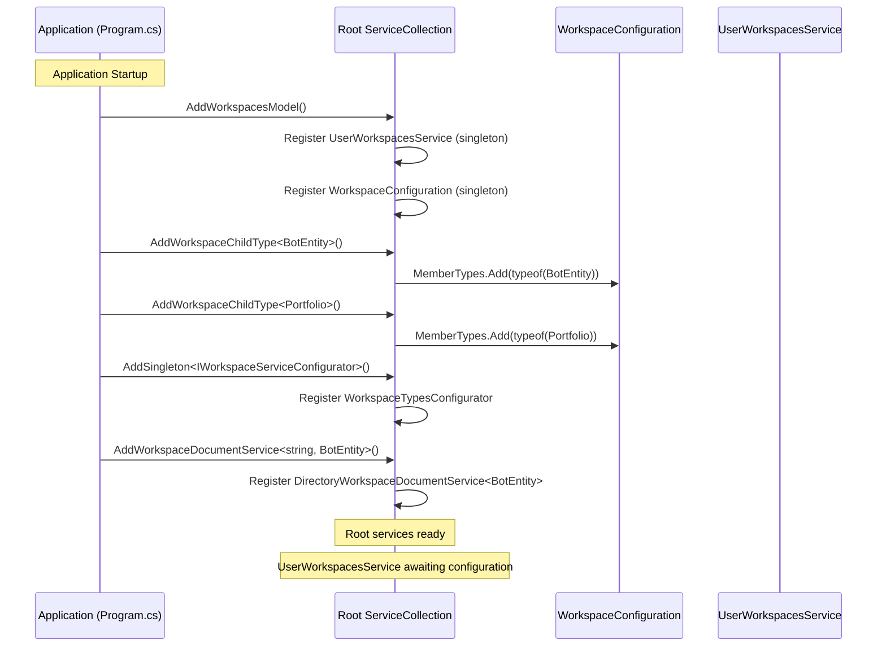

---

### User Login & Workspace Initialization

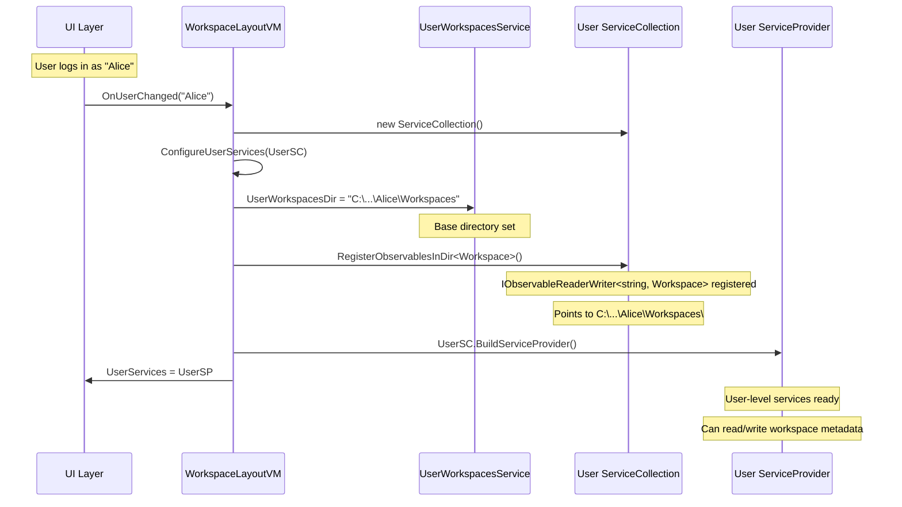

---

### Workspace Opening & Service Configuration

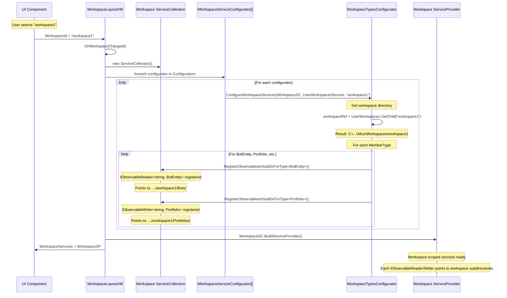

---

## Workspace Lifecycle

### Complete Workspace Lifecycle

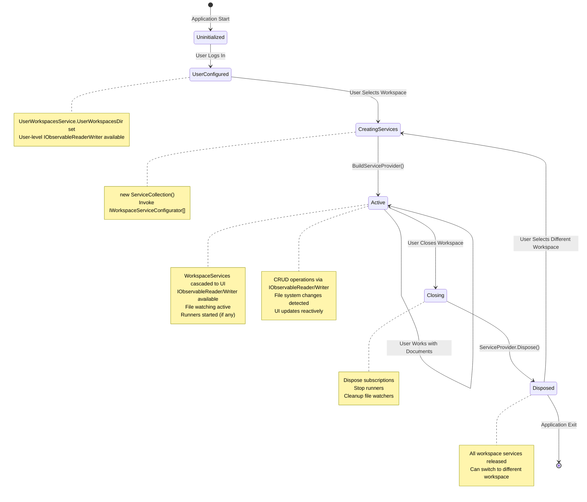

---

## Component Interaction Patterns

### Pattern 1: Automatic List View (ObservableDataView)

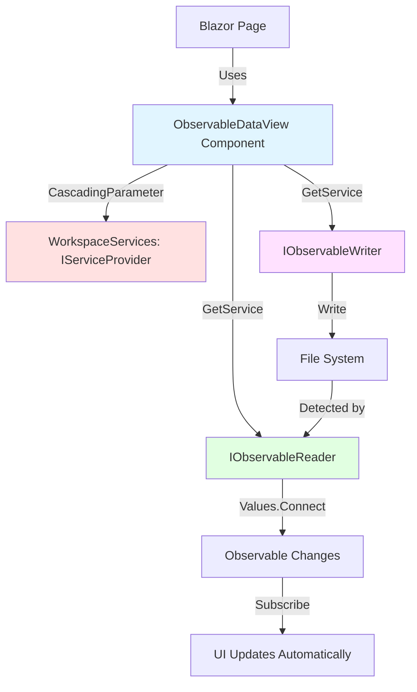

**Code Example**:
```razor
<CascadingValue Name="WorkspaceServices" Value="@WorkspaceServices">
    <ObservableDataView TKey="string"
                        TValue="BotEntity"
                        TValueVM="BotVM"
                        DataServiceProvider="@WorkspaceServices" />
</CascadingValue>
```

**Flow**:
1. Component receives `WorkspaceServices` via cascading parameter
2. Internally calls `GetService<IObservableReader<string, BotEntity>>()`
3. Subscribes to `reader.Values.Connect()`
4. Renders list reactively as documents change

---

### Pattern 2: Manual VM Integration

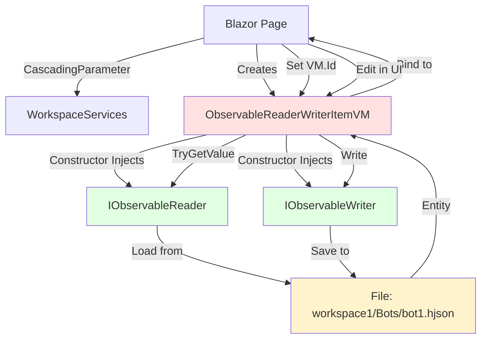

**Code Example**:
```csharp
@code {
    [CascadingParameter(Name = "WorkspaceServices")]
    public IServiceProvider? WorkspaceServices { get; set; }

    ObservableReaderWriterItemVM<string, BotEntity, BotVM>? vm;

    protected override void OnInitialized()
    {
        // Manually create VM, injecting workspace services
        var reader = WorkspaceServices.GetService<IObservableReader<string, BotEntity>>();
        var writer = WorkspaceServices.GetService<IObservableWriter<string, BotEntity>>();
        vm = new ObservableReaderWriterItemVM<string, BotEntity, BotVM>(reader, writer);
        vm.Id = BotId;  // From route parameter
    }
}
```

---

### Pattern 3: Runner Lifecycle

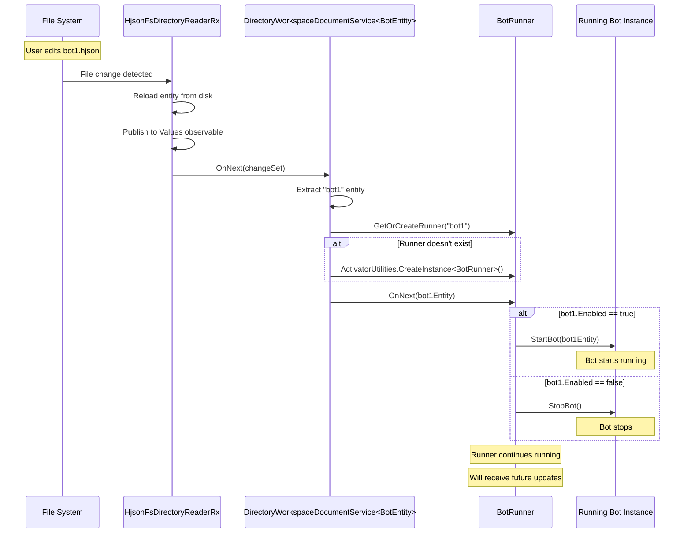

---

## Data Flow Diagrams

### Write Operation Flow

```mermaid
graph LR
    A[UI Edit] -->|User changes entity| B[ViewModel]
    B -->|Calls Save/Write| C[IObservableWriter]
    C -->|Serialize to HJSON| D[Serializer]
    D -->|Write bytes| E[File System]
    E -->|bot1.hjson created/updated| F[Workspace/Bots/bot1.hjson]

    F -->|File watcher detects| G[FileSystemWatcher]
    G -->|Notify| H[HjsonFsDirectoryReaderRx]
    H -->|Read & deserialize| I[IObservableReader]
    I -->|Publish change| J[Observable<ChangeSet>]
    J -->|Update subscribers| K[Other UI Components]
    J -->|Notify| L[Document Runners]

    style A fill:#e1f5ff
    style B fill:#ffe1e1
    style C fill:#ffe1ff
    style F fill:#fff3cd
    style I fill:#e1ffe1
```

---

### Read Operation Flow

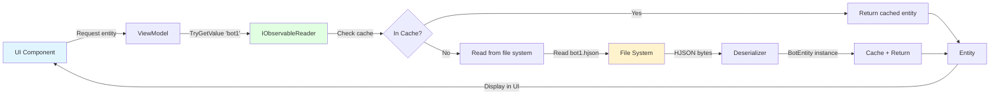

---

## Service Resolution Paths

### Resolving Workspace Services from Blazor

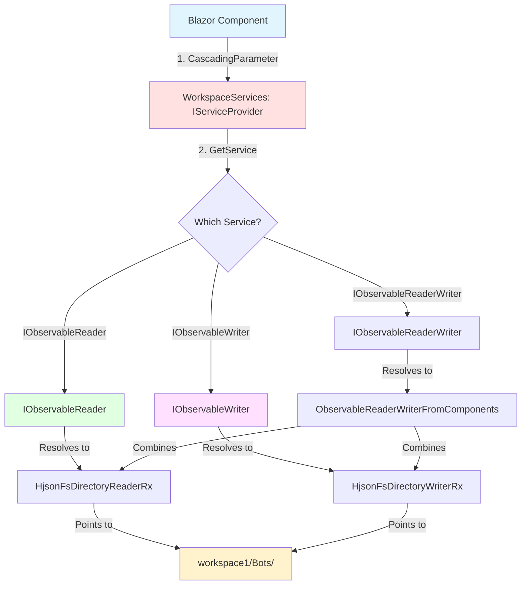

**Resolution Rules**:
1. Component gets `WorkspaceServices` via `[CascadingParameter(Name = "WorkspaceServices")]`
2. Calls `WorkspaceServices.GetService<T>()` to resolve workspace-scoped services
3. Each workspace has **separate instances** pointing to **different directories**
4. Services are **isolated** per workspace - no cross-workspace contamination

---

### Service Provider Hierarchy

```mermaid
graph TD
    A[Root ServiceProvider] -->|Singleton| B[UserWorkspacesService]
    A -->|Singleton| C[IConfiguration]
    A -->|Singleton| D[ILogger]
    A -->|Singleton| E[WorkspaceConfiguration]
    A -->|Collection| F[IWorkspaceServiceConfigurator[]]

    G[User ServiceProvider] -->|User-scoped| H[IObservableReaderWriter<string, Workspace>]
    G -->|Parent| A

    I[Workspace1 ServiceProvider] -->|Workspace-scoped| J[IObservableReader<string, BotEntity>]
    I -->|Workspace-scoped| K[IObservableWriter<string, BotEntity>]
    I -->|Parent| A

    L[Workspace2 ServiceProvider] -->|Workspace-scoped| M[IObservableReader<string, BotEntity>]
    L -->|Workspace-scoped| N[IObservableWriter<string, BotEntity>]
    L -->|Parent| A

    J -.->|Points to| O[workspace1/Bots/]
    M -.->|Points to| P[workspace2/Bots/]

    style A fill:#ffe1e1
    style G fill:#e1f5ff
    style I fill:#e1ffe1
    style L fill:#e1ffe1
    style O fill:#fff3cd
    style P fill:#fff3cd
```

**Key Points**:
- **Root Services**: Application-wide singletons (logger, config, workspace infrastructure)
- **User Services**: Per-user scope (workspace list for this user)
- **Workspace Services**: Per-workspace scope (readers/writers pointing to workspace directories)
- Each workspace service provider has **independent instances** of `IObservableReader/Writer`
- Workspace services **do NOT exist** in root container (common mistake!)

---

## Common Integration Patterns

### Pattern: Multi-Workspace Application

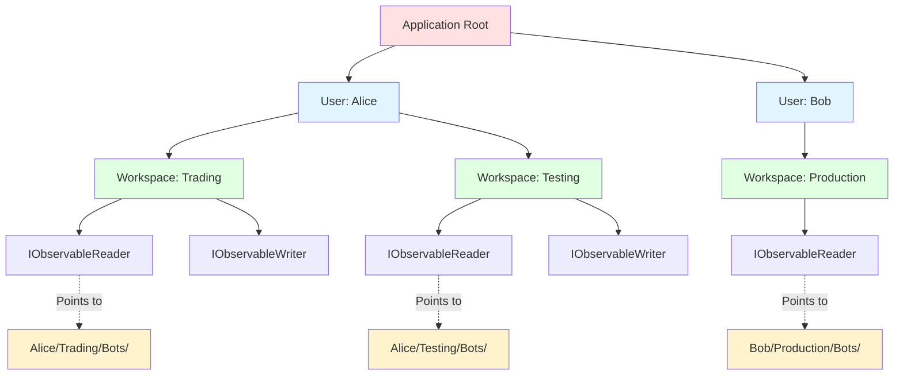

**Isolation Guarantees**:
- Each user has **separate workspace directories**
- Each workspace has **separate service providers**
- No service sharing between workspaces
- No data leakage between users or workspaces

---

## Summary Diagram: Complete Integration

```mermaid
graph TB
    subgraph "Application Startup"
        A1[Program.cs] -->|AddWorkspaceChildType| A2[WorkspaceConfiguration]
        A1 -->|AddSingleton| A3[UserWorkspacesService]
        A1 -->|AddSingleton| A4[IWorkspaceServiceConfigurator[]]
    end

    subgraph "User Login"
        B1[WorkspaceLayoutVM] -->|Set UserWorkspacesDir| A3
        B1 -->|RegisterObservablesInDir<Workspace>| B2[User ServiceCollection]
        B2 -->|BuildServiceProvider| B3[UserServices]
    end

    subgraph "Workspace Open"
        C1[WorkspaceLayoutVM.OnWorkspaceChanged] -->|new ServiceCollection| C2[Workspace ServiceCollection]
        C1 -->|foreach configurator| A4
        A4 -->|ConfigureWorkspaceServices| C2
        C2 -->|RegisterObservablesInSubDir| C3[IObservableReader/Writer]
        C2 -->|BuildServiceProvider| C4[WorkspaceServices]
    end

    subgraph "Blazor UI"
        D1[WorkspaceLayout] -->|CascadingValue| D2[Child Components]
        D2 -->|CascadingParameter| C4
        D2 -->|GetService| C3
        C3 -->|Read/Write| D3[File System]
    end

    subgraph "Reactive Updates"
        D3 -->|File change| E1[FileSystemWatcher]
        E1 -->|Notify| C3
        C3 -->|Observable.OnNext| E2[UI Components]
        C3 -->|Observable.OnNext| E3[Document Runners]
    end

    style A1 fill:#ffe1e1
    style B3 fill:#e1f5ff
    style C4 fill:#e1ffe1
    style D3 fill:#fff3cd
```

---

## Related Documentation

### Architecture Documentation
- **[Workspace Architecture Overview](README.md)** - High-level concepts and patterns
- **[Service Scoping Deep Dive](service-scoping.md)** - Detailed DI and scoping mechanics
- **[Document Type System](document-types.md)** - Defining and registering document types

### Project Documentation
- **[LionFire.Workspaces.Abstractions](../../../src/LionFire.Workspaces.Abstractions/CLAUDE.md)** - Interfaces and contracts
- **[LionFire.Workspaces](../../../src/LionFire.Workspaces/CLAUDE.md)** - Core implementation
- **[LionFire.Workspaces.UI.Blazor](../../../src/LionFire.Workspaces.UI.Blazor/CLAUDE.md)** - Blazor UI components *(pending)*

### Related Systems
- **[MVVM Architecture](../mvvm/README.md)** - ViewModel patterns
- **[Blazor MVVM Patterns](../../ui/blazor-mvvm-patterns.md)** - UI integration patterns
- **[LionFire.Reactive](../../../src/LionFire.Reactive/CLAUDE.md)** - Observable infrastructure

---

## Notes

This integration diagram document is marked as **OPTIONAL** in the task list because the concepts are covered in detail in the other workspace architecture documents. However, this visual reference provides:

1. **Mermaid Diagrams** - Visual representation of complex flows
2. **Sequence Diagrams** - Temporal flow of initialization and operations
3. **State Diagrams** - Lifecycle states and transitions
4. **Graph Diagrams** - Component relationships and data flow

Use this document as a **visual companion** to the textual documentation in README.md, service-scoping.md, and document-types.md.
